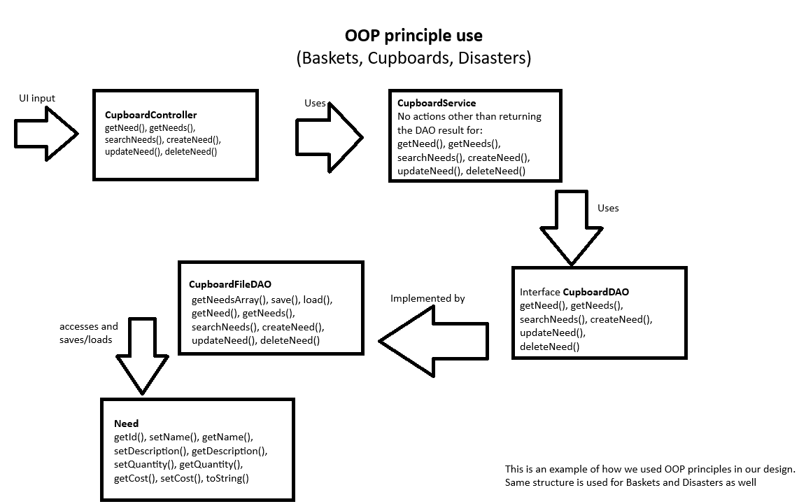

# PROJECT Design Documentation

> _The following template provides the headings for your Design
> Documentation.  As you edit each section make sure you remove these
> commentary 'blockquotes'; the lines that start with a > character
> and appear in the generated PDF in italics but do so only **after** all team members agree that the requirements for that section and current Sprint have been met. **Do not** delete future Sprint expectations._

## Team Information
* Team name: Team1A: Ufund-Disaster-Relief
* Team members
  * Emma Wheeler
  * Bennett Griggs
  * Mary Almazan
  * Demitri Clark

## Executive Summary

Ufund-Disaster-Relief is a web app designed to make disaster relief fundraising more direct and impactful. The idea is simple: relief groups (Admins) can post specific items they need.. like food, blankets, or hygiene kits—and people who want to help (Helpers) can fund those items directly.
 
 Instead of just donating money into a general pot, Helpers get to see exactly what their money is going toward. This creates more trust and gives donors a sense of real contribution. The system is built with a clear separation of roles, a straightforward user interface, and solid backend support to keep everything running smoothly.
 
 The app uses a Model–View–ViewModel (MVVM) architecture, with Angular on the frontend and Java/Spring on the backend. It’s built to be simple, transparent, and easy for both Admins and Helpers to use, especially when time and clarity matter most.
 
### Purpose
>  _**[Sprint 2 & 4]** Provide a very brief statement about the project and the most
> important user group and user goals._

This project is a fundraising website to help fund various needs for disaster relief groups.

### Glossary and Acronyms
> _**[Sprint 2 & 4]** Provide a table of terms and acronyms._

| Term | Definition |
|------|------------|
| SPA | Single Page |
| Need| An item, defined by name, description, cost, and quantity, that an admin wants |
|Admin| Users who make and edit needs|
|Helper| Users who fund needs| 

## Requirements

This section describes the features of the application.

> _In this section you do not need to be exhaustive and list every
> story.  Focus on top-level features from the Vision document and
> maybe Epics and critical Stories._

- Admins can create and edit needs

### Definition of MVP
The minimum viable product must include a persistant list of needs that is editable by admins and viewable by helpers,and user baskets for each non-admin account that when needs are purchased from, will decrease the count of and eventually remove all purchased needs.
These user baskets must not be editable by admins, and the total list of needs must not be directly interactable by helper accounts, only changed by the aforementioned checkout system. 

Helper/Admin accounts are accessed by username in a login screen. 

### MVP Features
MVP STORIES:
- NEEDS:
    - AS an admin, I WANT to create a new need (name [unique], cost, quantity) from the UI SO THAT it is added to the cupboard.
    - AS a user, I WANT to see the entire cupboard of needs in the UI SO THAT I have access to all of the needs for the organization.
    - AS an admin, I WANT to updates needs from the UI so that it is saved in the cupboard
    - AS an admin, I WANT to delete needs from the UI so that it is removed from the cupboard
    - AS a helper, I WANT to search needs by keywords so that I can find needs I am looking for
- BASKETS:
    - AS a helper, I WANT to be able to access my own cart to purchase needs
    - AS a helper, I WANT to add needs to my cart so I can purchase them
    - AS a helper, I WANT to remove needs from my cart in case I decide not to purchase them
    - AS a helper, I WANT to purchase needs from my cart to help with fundraising

### Enhancements
- CHECKOUT IMPROVEMENTS:
    - As a helper, I want to be able to purchase more than one of a need at a time, to save my time
    - As a HELPER, I want to PURCHASE ALL MY NEEDS AT ONCE to SAVE TIME.
    - As a HELPER, I want TO SEE RECEIPTS OF MY PURCHASES, so I CAN KNOW WHAT I BOUGHT, WHEN I BOUGHT IT, AND FOR HOW MUCH
- DISASTERS:
    - AS an admin, I want to create a new disaster (name, description) so helpers can see what disasters are being fundraised for
    - AS an admin, I want to add needs to a disaster so helpers can purchase needs for causes they care about
    - AS an admin, I want to remove needs from a disaster in case they do not apply to a disaster anymore
    - AS a helper, I want to be able to sort needs by disaster specific disaster
    - AS a helper, I want to be able to sort needs by associated disaster

## Application Domain

This section describes the application domain.

> _**[Sprint 2 & 4]** Provide a high-level overview of the domain for this application. You
> can discuss the more important domain entities and their relationship
> to each other._

## Architecture and Design

This section describes the application architecture.

### Summary

The following Tiers/Layers model shows a high-level view of the webapp's architecture. 
**NOTE**: detailed diagrams are required in later sections of this document.
> _**[Sprint 1]** (Augment this diagram with your **own** rendition and representations of sample system classes, placing them into the appropriate M/V/VM (orange rectangle) tier section. Focus on what is currently required to support **Sprint 1 - Demo requirements**. Make sure to describe your design choices in the corresponding _**Tier Section**_ and also in the _**OO Design Principles**_ section below.)_

The web application, is built using the Model–View–ViewModel (MVVM) architecture pattern. 

The Model stores the application data objects including any functionality to provide persistance. 

The View is the client-side SPA built with Angular utilizing HTML, CSS and TypeScript. The ViewModel provides RESTful APIs to the client (View) as well as any logic required to manipulate the data objects from the Model.

Both the ViewModel and Model are built using Java and Spring Framework. Details of the components within these tiers are supplied below.

### Overview of User Interface

When the user starts up the UFUND, they are presented with a login screen with a field for the username.
The user can then either enter "Helper" or "Admin" to login with the corresponding user type.
As a helper, you have several components in the user interface that allow you to interact with the Angular project: Retrieve a Specific Need, Search Needs by Disaster, Search needs by Description, Needs Available, Disaster list, and Basket. Using the searching methods allows you to focus the Needs Available component to a select few needs which match the query. From the Needs Available component you can add a need into your basket, along with a quantity. After you have added these needs to your basket you can checkout, which will then bring you to a receipt screen which displays the purchase you've made.
As an Admin, the components displayed are as follows: Edit Needs, Add a New Need, Add a New Disaster Disaster, and Add Needs to Disaster. All of which have the Admin capabilities of editing the details.

### View Tier

In the UFUND, as a Helper, you can search through needs given a variaty of methods (ex: by disaster, description). The results will be fetched by the "Needs Available" component which uses HTTP requests to fetch the needs which match the query. Then, you can choose which needs to buy by adding them to your basket with a specified quantity. Once purchased, the needs quantity is updated and a reciept is given. As an Admin, you can create and edit these Disasters by using
the corrosponding Admin components of the UFUND, which will then be updated using the same HTTP requests.

### ViewModel Tier

The Need.java class supports the fundamental editing and listing of needs on both ends of the application (Helper and Admin), it offers functionality for retrieving details about a need. As well as allowing Admins to change the specific details of such a need.

The Disaster.java class supports the functionality of creating, deleting, and editing each Disaster which serves as a category for Needs to be a part of.

The Basket.java class allows users to create their own shopping cart experience, essentially serving as a list of needs which can be used later to generate a reciept.

These three classes are the backbone of the project and together cover most of the functionality in the backend. They each provide the correct information for the frontend to fetch when displaying the details about each of their specific areas of interest. The Need.java file allows the frontend to fetch details for each of the needs listed whether being displayed on the Helper or Admin side. As well as allowing an Admin to use its functions to edit or create a need. The Disaster.java file works similarly, allowing Helpers and Admins to view and edit details. The Basket.java allows helpers to create lists of needs that they can use to generate a receipt. The Basket.java file works in colloboration with the Need.java file, allowing the correct quantity to be subtracted from the Need once a reciept has been generated.

### Model Tier
> _**[Sprint 1]** List the classes supporting this tier and provide a description of there purpose._

- Need: Something an admin wants funded
    - ID: Id for internal use
    - Name: Name of need
    - Description: Description of need
    - Quantity: Number available for purchase
    - Cost: Cost per need

- Basket: A collection of needs in a user's cart. 
    - ID: Id for internal use
    - Username: Username of associated user
    - items: a list of id's for all needs in a basket
    - counts: a list of ints representing the count of each need with the matching index

- Disaster: A collection of needs associated with a disasrer
    - ID: Id for internal use
    - Username: Name of the disaster
    - Description: Description of the disaster
    - items: a list of id's for all needs associated with a disaster
  

## OO Design Principles

> _**[Sprint 1]** Name and describe the initial OO Principles that your team has considered in support of your design (and implementation) for this first Sprint._

> _**[Sprint 2, 3 & 4]** Will eventually address upto **4 key OO Principles** in your final design. Follow guidance in augmenting those completed in previous Sprints as indicated to you by instructor. Be sure to include any diagrams (or clearly refer to ones elsewhere in your Tier sections above) to support your claims._

This diagram shows an example of how we used the Object-Oriented Programming design principles in our code. Note that this is a representation of how we used them with the Cupboard line of classes; Baskets line and Disasters line function similarly.

- Controller
    - System events should be dealt with by a non-UI class specifically responsible for working with those events
    - Baskets, Cupboard, and Disasters have controllers.
    - System events go to Controller instead of directly going to the respective objects.
    - Controller classes use Service classes to access the DAO.
    - Controllers handle possible IOExceptions.
    - Shown in above diagram.
- Pure Fabrication
    - Use of Service classes (the titular Pure Fabrications) to enable access to other classes without functional classes connecting directly to other functional classes.
    - These classes have minimal functionality and serve only to gap input handling classes and data classes.
    - Baskets, Cupboard, and Disasters have services.
    - Controllers access Services when they need to access model classes.
    - Services access DAO classes in turn, forwarding results back up to Controller.
    - Shown in above diagram.
- Dependency inversion
    - High-level modules should not implement from low-level modules.
    - Abstract lower-level modules for use in high-level modules (i.e. use interfaces)
    - We used interfaces for Basket, Cupboard, and Disasters.
    - These interfaces provide functions for higher-level files to use without knowing anything about the lower-level files being interfaced with.
    - In the above diagram you can see how we used interfaces to allow Services to access information without making them work directly with the data; DAO interfaces are instead implemented by FileDAO classes which work with the data represented by the lowest classes.
- Open-closed principle
    - Classes should be open for extension, but closed for modification.
    - All our classes use methods to allow modification of values instead of directly exposing values.
    - Methods we created can be seen on the diagram.
    - We don't currently have a need for extensions, but our classes can be extended if it is needed.
    - This would likely, in future usage and updating of our program, be used for variants/subtypes of Needs, Cupboards, Baskets, and Disasters.

> _**[Sprint 3 & 4]** OO Design Principles should span across **all tiers.**_

## Static Code Analysis/Future Design Improvements
> _**[Sprint 4]** With the results from the Static Code Analysis exercise, 
> **Identify 3-4** areas within your code that have been flagged by the Static Code 
> Analysis Tool (SonarQube) and provide your analysis and recommendations.  
> Include any relevant screenshot(s) with each area._
> _**[Sprint 4]** Discuss **future** refactoring and other design improvements your team would explore if the team had additional time._

    I [Emma], alongside my teammates, could not figure out how to properly install SonarQube, however, when testing the functionality of Sprint 3, one group noticed an issue where all baskets were being pulled instead of just the basket of the user, allowing for users to access others' baskets using the inspect elements feature on google. Future design improvements should seek to make user basket selection possible without calling all baskets, or improve security when doing so. I reccomend looking at LoadUserBasket() in app.component.ts, as this is likely where the unessecary call is made and security could be improved. 

    Additionally, app.component.ts could be broken up into multiple ts files, as it is currently over 500 lines long, and handles all logic functionality for all frontend interactions. Perhaps adding receipts.ts, as well as logic functions in ____-service.ts files may be helpful as well. 

    Finally, while UI improvements were planned, they never were implemented. The UI currently sees no collapsable menus, all elements on one page stacked on top of each other, and a default angular settings color scheme. Future design improvements could be made my re-arranging contents within the app.component.html, making new html files to load separate pieces [admin features, helper features, etc.], and editing the .css file.

## Testing
> _This section will provide information about the testing performed
> and the results of the testing._

Emma wrote test files for Need.java, Basket.java, CupboardFileDAO.java, and all controller files.
Bennett wrote test files for Disaster.java, DisastersFileDAO.java, and BasketsFileDAO.java.

### Acceptance Testing
> _**[Sprint 2 & 4]** Report on the number of user stories that have passed all their
> acceptance criteria tests, the number that have some acceptance
> criteria tests failing, and the number of user stories that
> have not had any testing yet. Highlight the issues found during
> acceptance testing and if there are any concerns._

Sprint 2: 6/6 tests passed
  Needs: Needs have passed all acceptance testing
  Baskets: Baskets have passed all acceptance testing
  Admin Features: Admin features have passed all acceptance testing
  Helper features: Helper features have mostly passed acceptance testing, but are missing:
    - password authentication
    - checkout more than 1 quantity of each item

Sprint 3: 

### Unit Testing and Code Coverage
> _**[Sprint 4]** Discuss your unit testing strategy. Report on the code coverage
> achieved from unit testing of the code base. Discuss the team's
> coverage targets, why you selected those values, and how well your
> code coverage met your targets._

Emma wrote most of the unit tests (Need, Basket, CupboardFileDAO, all controllers), Bennett wrote the remainder.
Our code coverage target value was 90%, and we had 93.1% code coverage in the end. 90% was intended to ensure we covered all important classes; things that were acceptable to not be covered include Services (because they are pure fabrications) and other bits that just forward one thing to another.

>_**[Sprint 2, 3 & 4]** **Include images of your code coverage report.** If there are any anomalies, discuss
> those._

## Ongoing Rationale
>_**[Sprint 1, 2, 3 & 4]** Throughout the project, provide a time stamp **(yyyy/mm/dd): Sprint # and description** of any _**mayor**_ team decisions or design milestones/changes and corresponding justification._

(2025/03/27) Sprint 3: Decided to add receipts
(2025/04/08) Sprint 3: Decided not to focus on UI improvements due to time constraints
(2025/04/09) Sprint 4: Distributed and assigned specific portions of the final design doc work to each member